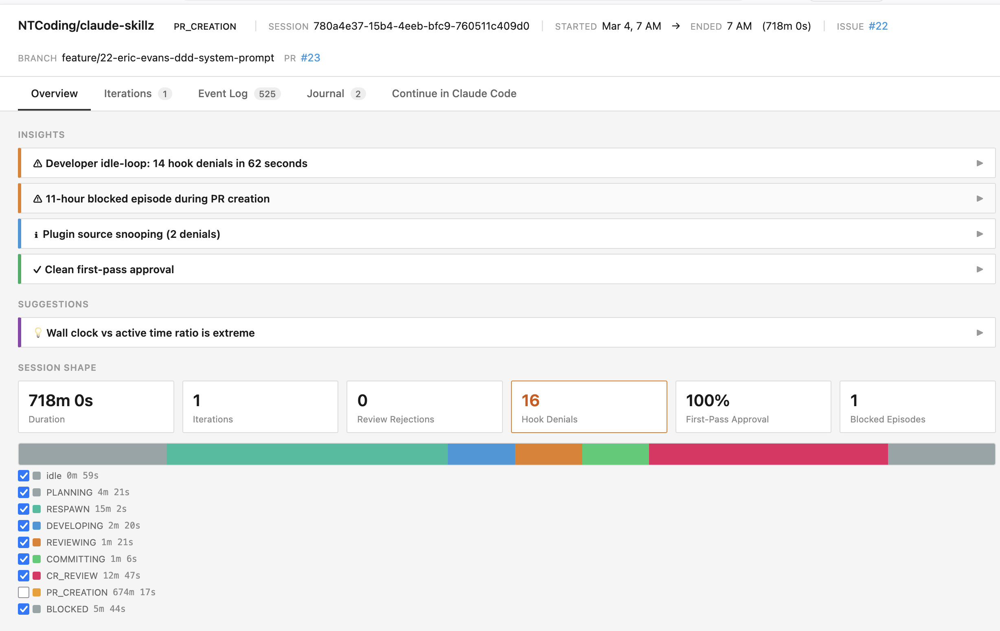
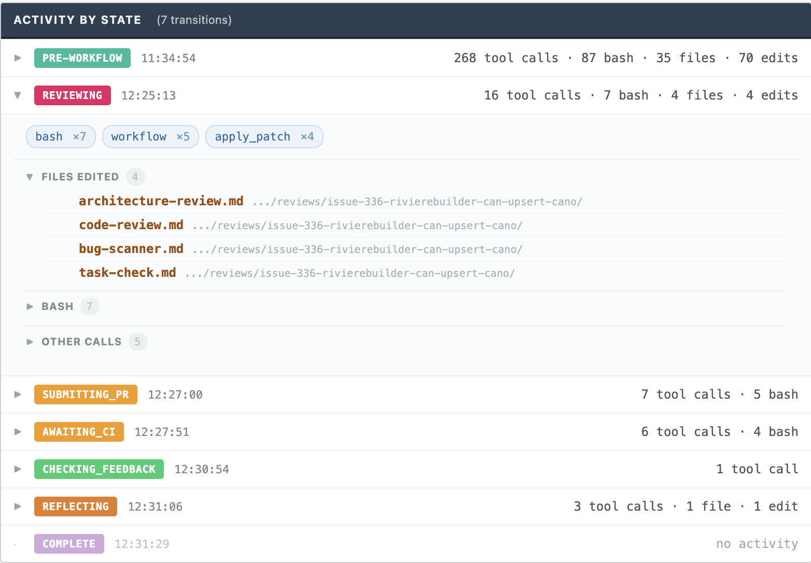
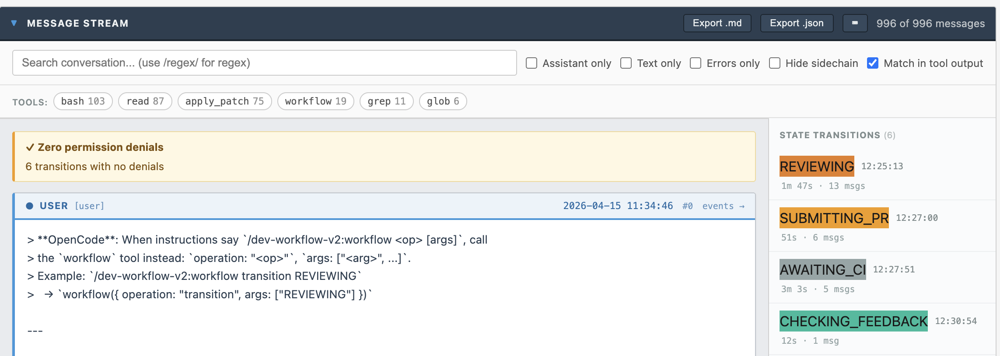
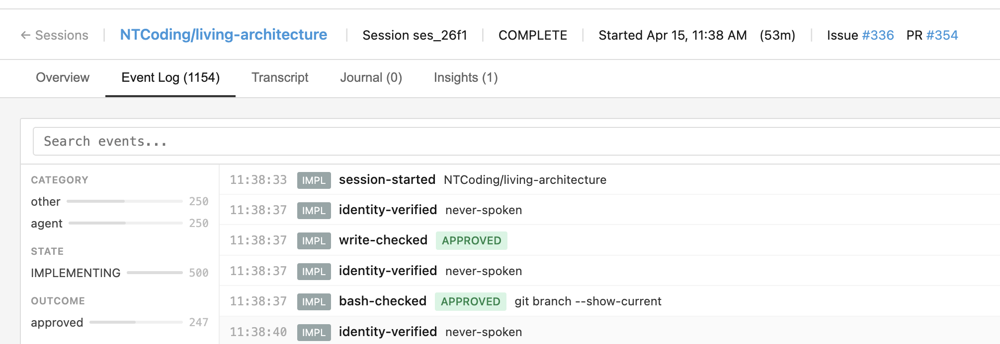

# deterministic-agent-workflows

Coding agents are bad at following process from markdown alone.

This library puts the process in code.

It lets users define workflow states, legal transitions, and tool rules. The runtime then enforces them.

Example:
- block `Write` outside `DEVELOPING`
- block `gh pr create` before `REVIEWING`
- block transition to `REVIEWING` until there is at least one commit and the working tree is clean

It also records workflow events so the Control Center can show:
- current state
- transitions
- blocked actions
- session history

## Install

```bash
pnpm add @nt-ai-lab/deterministic-agent-workflow-engine
pnpm add @nt-ai-lab/deterministic-agent-workflow-dsl
pnpm add @nt-ai-lab/deterministic-agent-workflow-cli

# choose an adapter
pnpm add @nt-ai-lab/deterministic-agent-workflow-opencode
# or
pnpm add @nt-ai-lab/deterministic-agent-workflow-claude-code
```

## OpenCode example

Define the workflow in the user repo, then plug it into OpenCode.

```ts
import { createOpenCodeWorkflowPlugin } from '@nt-ai-lab/deterministic-agent-workflow-opencode'
import { fileURLToPath } from 'node:url'
import { dirname, join } from 'node:path'

import type {
  Workflow,
  WorkflowDeps,
} from './features/workflow/domain/workflow'
import type {
  WorkflowOperation,
  WorkflowState,
  StateName,
} from './features/workflow/domain/workflow-types'
import { WORKFLOW_DEFINITION } from './features/workflow/infra/persistence/workflow-definition'
import { ROUTES, PRE_TOOL_USE_POLICY } from './features/workflow/entrypoint/workflow-cli'
import { getGitInfo } from './features/workflow/infra/external-clients/git/git'

const pluginRoot = join(dirname(fileURLToPath(import.meta.url)), '..', '..')

export default createOpenCodeWorkflowPlugin<
  Workflow,
  WorkflowState,
  WorkflowDeps,
  StateName,
  WorkflowOperation
>({
  workflowDefinition: WORKFLOW_DEFINITION,
  routes: ROUTES,
  bashForbidden: PRE_TOOL_USE_POLICY.bashForbidden,
  isWriteAllowed: PRE_TOOL_USE_POLICY.isWriteAllowed,
  pluginRoot,
  commandDirectories: [join(pluginRoot, 'commands')],
  commandPrefix: 'dev-workflow:',
  buildWorkflowDeps: (platform) => ({
    getGitInfo,
    now: platform.now,
  }),
})
```

## Workflow definition + policy example

Step 1: define your state and operation types.

```ts
export type WorkflowOperation =
  | 'record-plan'
  | 'record-branch'
  | 'record-implementation-progress'
  | 'record-review-passed'
  | 'record-review-failed'
  | 'record-pr'
```

Step 2: define the registry and tool policy.

```ts
export const WORKFLOW_REGISTRY = {
  PLANNING: {
    canTransitionTo: ['DEVELOPING'],
    allowedWorkflowOperations: ['record-plan'],
    forbidden: { write: true },
  },
  DEVELOPING: {
    canTransitionTo: ['REVIEWING'],
    allowedWorkflowOperations: ['record-branch', 'record-implementation-progress'],
  },
  REVIEWING: {
    canTransitionTo: ['DEVELOPING'],
    allowedWorkflowOperations: ['record-review-passed', 'record-review-failed', 'record-pr'],
    forbidden: { write: true },
  },
} as const

export const PRE_TOOL_USE_POLICY = {
  bashForbidden: {
    commands: ['gh pr create'],
  },
  isWriteAllowed: (_filePath: string, state: WorkflowState) => {
    return state.currentStateMachineState === 'DEVELOPING'
  },
} as const
```

That policy means a write is denied outside `DEVELOPING`.

## Workflow operations

A workflow operation is a command the agent can invoke, for example `record-pr`.

Flow:

1. the agent runs `workflow record-pr 123`
2. the CLI routes that command to a workflow method
3. the workflow method emits an event
4. the engine applies that event to state and persists it

`workflow-cli.ts`

```ts
import { arg, defineRoutes } from '@nt-ai-lab/deterministic-agent-workflow-cli'

export const ROUTES = defineRoutes<Workflow, WorkflowState>({
  'record-pr': {
    type: 'transaction',
    args: [arg.number('PR_NUMBER')],
    handler: (workflow, prNumber) => workflow.recordPr(prNumber),
  },
})
```

Add your normal `init` and `transition` routes alongside custom operations like `record-pr`.

`workflow.ts`

```ts
import {
  type BaseEvent,
  type RehydratableWorkflow,
} from '@nt-ai-lab/deterministic-agent-workflow-engine'
import { applyEvent } from './fold'
import type { WorkflowState } from './workflow-types'

export type WorkflowDeps = { now: () => string }

export class Workflow implements RehydratableWorkflow<WorkflowState> {
  private pendingEvents: BaseEvent[] = []

  constructor(
    private state: WorkflowState,
    private readonly deps: WorkflowDeps,
  ) {}

  getState(): WorkflowState {
    return this.state
  }

  appendEvent(event: BaseEvent): void {
    this.pendingEvents = [...this.pendingEvents, event]
    this.state = applyEvent(this.state, event)
  }

  recordPr(prNumber: number) {
    this.appendEvent({
      type: 'pr-recorded',
      at: this.deps.now(),
      prNumber,
    })
  }
}
```

## Rehydration

Use one function to update state from events, and use it in both places:

- `appendEvent(...)` for in-memory changes
- `WORKFLOW_DEFINITION.fold(...)` for rebuilding state from the event store

```ts
import { parseEvent, type WorkflowEvent } from './workflow-events'
import type { BaseEvent } from '@nt-ai-lab/deterministic-agent-workflow-engine'

function applyWorkflowEvent(state: WorkflowState, event: WorkflowEvent): WorkflowState {
  switch (event.type) {
    case 'pr-recorded':
      return {
        ...state,
        prNumber: event.prNumber,
      }
  }
}

export function applyEvent(state: WorkflowState, event: BaseEvent): WorkflowState {
  const parsedEvent = parseEvent(event)
  switch (parsedEvent.type) {
    case 'transitioned':
      return {
        ...state,
        currentStateMachineState: parsedEvent.to,
      }
    case 'pr-recorded':
      return applyWorkflowEvent(state, parsedEvent)
    default:
      return state
  }
}

export const WORKFLOW_DEFINITION = {
  fold: (state: WorkflowState, event: BaseEvent) => applyEvent(state, event),
  buildWorkflow: createWorkflow,
  getRegistry: () => WORKFLOW_REGISTRY,
  // ...other required fields
}
```

## Claude Code example

```ts
import { createClaudeCodeWorkflowCli } from '@nt-ai-lab/deterministic-agent-workflow-claude-code'
import { createDefaultProcessDeps } from '@nt-ai-lab/deterministic-agent-workflow-cli'
import { WORKFLOW_DEFINITION } from './features/workflow/infra/persistence/workflow-definition'
import { ROUTES, PRE_TOOL_USE_POLICY } from './features/workflow/entrypoint/workflow-cli'

createClaudeCodeWorkflowCli({
  workflowDefinition: WORKFLOW_DEFINITION,
  routes: ROUTES,
  bashForbidden: PRE_TOOL_USE_POLICY.bashForbidden,
  isWriteAllowed: PRE_TOOL_USE_POLICY.isWriteAllowed,
  buildWorkflowDeps: (platform) => ({
    now: platform.now,
  }),
  processDeps: createDefaultProcessDeps(),
})
```

## Event store

The adapter creates the SQLite event store automatically.

- default path: `~/.workflow-events.db`
- override path: set `WORKFLOW_EVENTS_DB=/path/to/workflow-events.db`

That is the same database the Control Center reads.

## Control Center

The adapters write workflow events to `~/.workflow-events.db` by default.

Start the UI:

```bash
pnpm --filter deterministic-agent-workflows-control-center build:ui
pnpm --filter deterministic-agent-workflows-control-center start -- --db ~/.workflow-events.db --port 3120
```

Open `http://localhost:3120`

View all sessions stored in the database:


Analyze how much time was spent in each state of an inidividual session:



Explore what happened during each state:



Dig into the session transcript organized by workflow state:



Search the event log:




## References

- `examples/README.md`
- https://github.com/NTCoding/living-architecture/blob/main/tools/dev-workflow-v2/src/shell/opencode-plugin.ts
- https://github.com/NTCoding/autonomous-claude-agent-team
