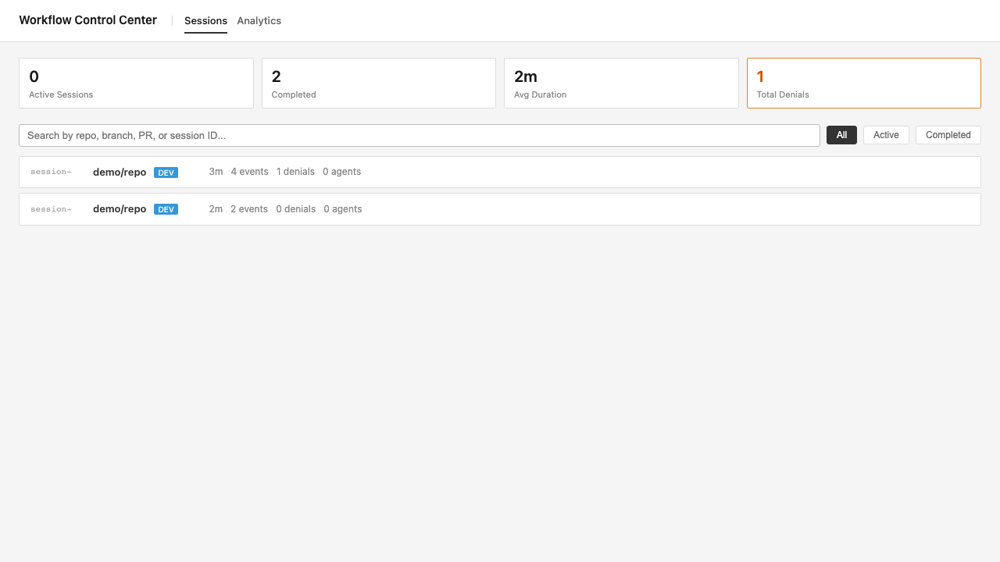

# deterministic-agent-workflows

Coding agents are bad at following process from markdown alone.

This library puts the process in code.

It lets users define workflow states, legal transitions, and tool rules. The runtime then enforces them.

Example:
- block `Write` outside `DEVELOPING`
- block `gh pr create` before `REVIEWING`
- block transition to `REVIEWING` until there is at least one commit and the working tree is clean

It also records workflow events so the Control Center can show:
- current state
- transitions
- blocked actions
- session history

## Install

```bash
pnpm add @nt-ai-lab/deterministic-agent-workflow-engine
pnpm add @nt-ai-lab/deterministic-agent-workflow-dsl
pnpm add @nt-ai-lab/deterministic-agent-workflow-cli

# choose an adapter
pnpm add @nt-ai-lab/deterministic-agent-workflow-opencode
# or
pnpm add @nt-ai-lab/deterministic-agent-workflow-claude-code
```

## OpenCode example

Define the workflow in the user repo, then plug it into OpenCode.

```ts
import { createOpenCodeWorkflowPlugin } from '@nt-ai-lab/deterministic-agent-workflow-opencode'
import { fileURLToPath } from 'node:url'
import { dirname, join } from 'node:path'

import type {
  Workflow,
  WorkflowDeps,
} from './features/workflow/domain/workflow'
import type {
  WorkflowOperation,
  WorkflowState,
  StateName,
} from './features/workflow/domain/workflow-types'
import { WORKFLOW_DEFINITION } from './features/workflow/infra/persistence/workflow-definition'
import { ROUTES, PRE_TOOL_USE_POLICY } from './features/workflow/entrypoint/workflow-cli'
import { getGitInfo } from './features/workflow/infra/external-clients/git/git'

const pluginRoot = join(dirname(fileURLToPath(import.meta.url)), '..', '..')

export default createOpenCodeWorkflowPlugin<
  Workflow,
  WorkflowState,
  WorkflowDeps,
  StateName,
  WorkflowOperation
>({
  workflowDefinition: WORKFLOW_DEFINITION,
  routes: ROUTES,
  bashForbidden: PRE_TOOL_USE_POLICY.bashForbidden,
  isWriteAllowed: PRE_TOOL_USE_POLICY.isWriteAllowed,
  pluginRoot,
  commandDirectories: [join(pluginRoot, 'commands')],
  commandPrefix: 'dev-workflow:',
  buildWorkflowDeps: (platform) => ({
    getGitInfo,
    now: platform.now,
  }),
})
```

## Route + policy example

```ts
import { arg, defineRoutes } from '@nt-ai-lab/deterministic-agent-workflow-cli'

export const ROUTES = defineRoutes<Workflow, WorkflowState>({
  init: { type: 'session-start' },
  transition: {
    type: 'transition',
    args: [arg.state('STATE', STATE_NAME_SCHEMA)],
  },
  'record-plan': {
    type: 'transaction',
    handler: (workflow) => workflow.executeRecording('record-plan'),
  },
})

export const PRE_TOOL_USE_POLICY = {
  bashForbidden: {
    commands: ['gh pr create'],
  },
  isWriteAllowed: (filePath: string, state: WorkflowState) => {
    return state.currentStateMachineState === 'DEVELOPING'
  },
} as const
```

That policy means a write can be denied before `DEVELOPING` and allowed after the workflow transitions into `DEVELOPING`.

## Claude Code example

```ts
import { createClaudeCodeWorkflowCli } from '@nt-ai-lab/deterministic-agent-workflow-claude-code'
import { createDefaultProcessDeps } from '@nt-ai-lab/deterministic-agent-workflow-cli'

createClaudeCodeWorkflowCli({
  workflowDefinition: WORKFLOW_DEFINITION,
  routes: ROUTES,
  bashForbidden: PRE_TOOL_USE_POLICY.bashForbidden,
  isWriteAllowed: PRE_TOOL_USE_POLICY.isWriteAllowed,
  buildWorkflowDeps: (platform) => ({
    now: platform.now,
  }),
  processDeps: createDefaultProcessDeps(),
})
```

## Control Center

The adapters write workflow events to `~/.workflow-events.db` by default.

Start the UI:

```bash
pnpm --filter deterministic-agent-workflows-control-center build:ui
pnpm --filter deterministic-agent-workflows-control-center start -- --db ~/.workflow-events.db --port 3120
```

Open `http://localhost:3120`



## References

- `examples/README.md`
- https://github.com/NTCoding/living-architecture/blob/main/tools/dev-workflow-v2/src/shell/opencode-plugin.ts
- https://github.com/NTCoding/autonomous-claude-agent-team
