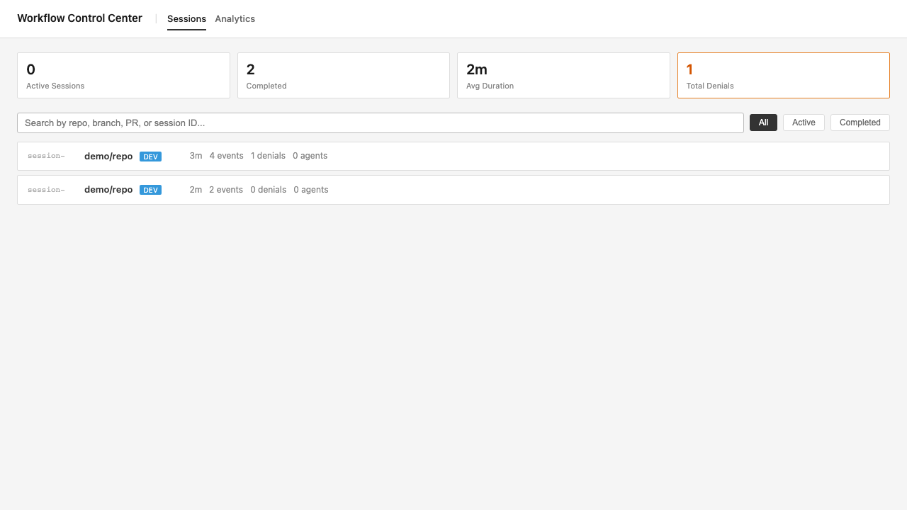
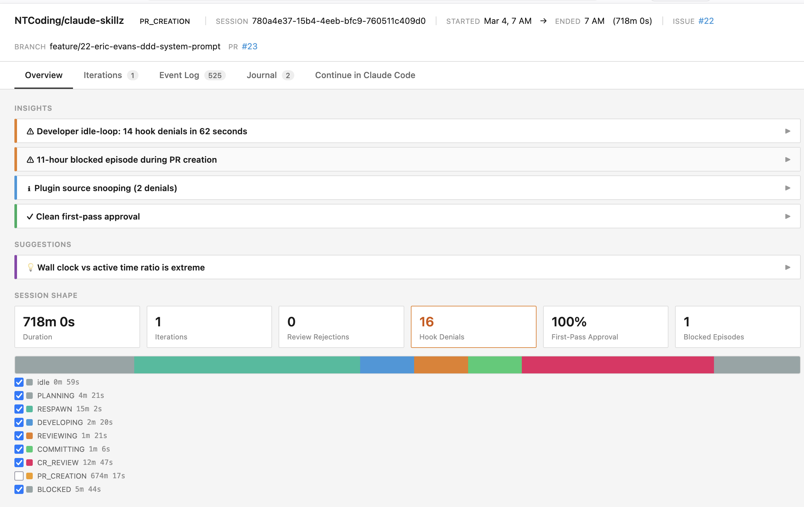
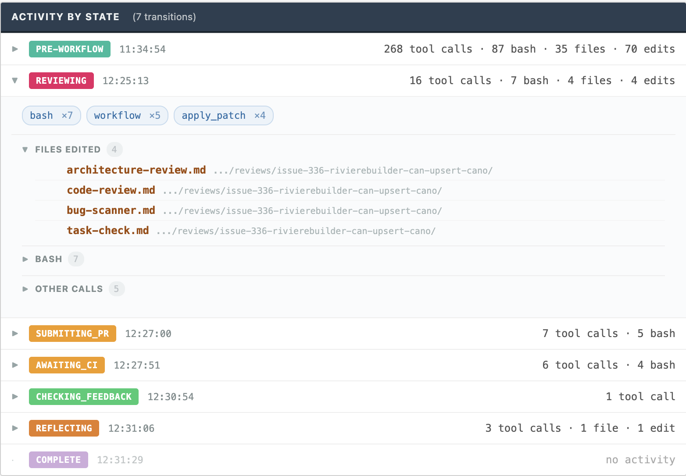
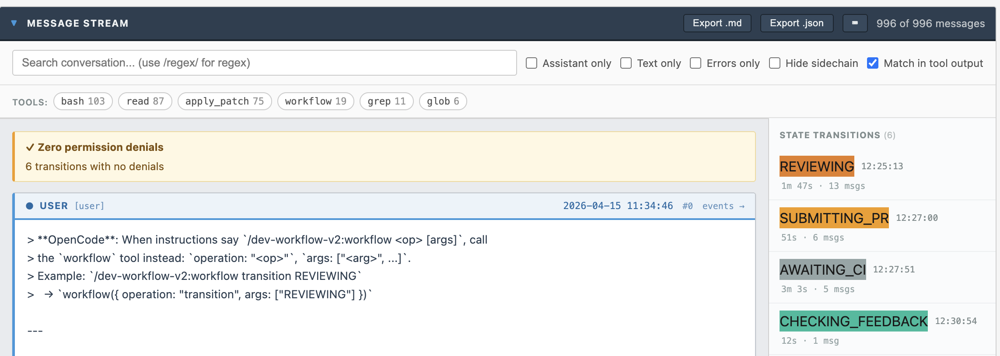
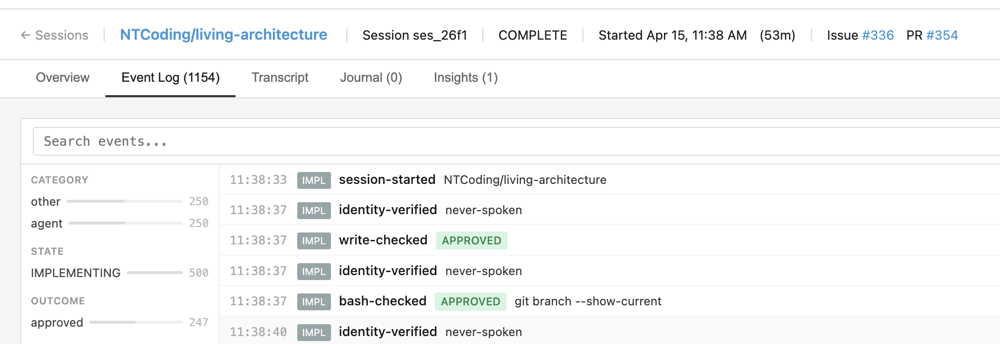

# deterministic-agent-workflows

Coding agents are bad at following process from markdown alone.

This library puts the process in code.

It lets users define workflow states, legal transitions, and tool rules. The runtime then enforces them.

Example:
- block `Write` outside `DEVELOPING`
- block `gh pr create` before `REVIEWING`
- block transition to `REVIEWING` until there is at least one commit and the working tree is clean

It also records workflow events so the Control Center can show:
- current state
- transitions
- blocked actions
- session history

## Install

```bash
pnpm add @nt-ai-lab/deterministic-agent-workflow-engine
pnpm add @nt-ai-lab/deterministic-agent-workflow-dsl
pnpm add @nt-ai-lab/deterministic-agent-workflow-cli
pnpm add @nt-ai-lab/deterministic-agent-workflow-event-store

# choose an adapter
pnpm add @nt-ai-lab/deterministic-agent-workflow-opencode
# or
pnpm add @nt-ai-lab/deterministic-agent-workflow-claude-code
# or
pnpm add @nt-ai-lab/deterministic-agent-workflow-codex
# or
pnpm add @nt-ai-lab/deterministic-agent-workflow-pi

# add this when review agents use ACP
pnpm add @nt-ai-lab/deterministic-agent-workflow-acp
```

## Durable ACP review coordination

Consumers own reviewer names, prompts, changed-file discovery, revisions, and the workflow state that triggers review. Pi consumers configure automation on their existing extension factory. The adapter waits for durable state and an idle agent before invoking consumer policy. It owns the coordinator and event-store lifetime; consumers do not construct an engine, open a database, or rehydrate events.

```ts
import { createAcpReviewAgentClient } from '@nt-ai-lab/deterministic-agent-workflow-acp'
import { createPiWorkflowExtension } from '@nt-ai-lab/deterministic-agent-workflow-pi'

const reviewClient = createAcpReviewAgentClient({
  command: '/absolute/path/to/acp-agent',
  args: [],
  mcpServers: constrainedFeedbackServers,
  timeoutMs: 15 * 60 * 1_000,
  cancellationGraceMs: 5_000,
})

const extension = createPiWorkflowExtension({
  ...workflowConfiguration,
  automation: {
    ownsState: (state) => state.currentStateMachineState === 'REVIEWING',
    onIdle: async (context) => {
      const request = await buildReviewRequest(context.getState(), context.signal)
      const result = await context.runReviews(request, reviewClient)
      // Consumer policy also checks external gates and handles failures.
      const nextState = await determineNextState(result, context.signal)
      context.runOperation('transition', nextState)
      context.resumeWithFreshContext(buildStateInstructions(context.getState()))
    },
  },
})
```

In this example, `workflowConfiguration`, `constrainedFeedbackServers`, `buildReviewRequest`, `determineNextState`, and `buildStateInstructions` are consumer-owned configuration and policy. A review request supplies bundle ID, repository, PR number, base/head revisions, changed files, state instructions, and reviewer definitions. The adapter supplies session identity and working directory. `runOperation` uses the consumer's existing validated routes and rejects unsuccessful operations. The callback must handle domain failures through those routes; an uncaught callback error shuts the Pi session down rather than resuming the old context.

Conversational tools and input are blocked while automation owns the state. Session shutdown aborts `context.signal`, cancels active reviews, and invalidates callback capabilities. Polling and other consumer work must honour this signal. The adapter recovers workflow-owned states on session startup. Persisted bundle identity remains the basis of reviewer recovery and retry reconciliation.

Each reviewer definition includes an immutable `version`. The coordinator request and completion provenance are pinned to the bundle, provider session and run, base revision, head revision, reviewer version, and a SHA-256 digest of the exact ordered changed-file list. ACP reviewers do not inherit GitHub credentials; provide only constrained MCP servers and non-credential environment values. Calling `runReviews` again with the same bundle resumes persisted provider sessions, while another active bundle for the same pull request fails closed.

Before starting or loading providers, the coordinator claims exclusive execution through its domain port. A competing coordinator or cancellation caller fails closed without launching providers or changing the owner's bundle. Calls already running on the same coordinator still share their result. Ownership is released after execution or cancellation settles, including failures. No new factory configuration is required. Advanced custom `ReviewJobStore` implementations must provide `claimReviewExecution`, excluding competing owners of the same stored bundle across connections and processes.

SQLite implements execution ownership using a separate exclusive-lock database under `<canonical-event-database-path>.locks/`. The event database remains writable, and different bundles do not share an execution lock. Lock files are intentionally retained: do not remove them while any runtime is active, since replacing an inode would bypass an existing lock. Use the same canonical event database and normal local SQLite filesystem locking; do not use hard-linked database aliases. In-memory stores use connection-local exclusion.

Process exit releases the native coordination lock without a timeout or lease expiry. Recovery can then reload persisted provider sessions under exclusive ownership. This lock prevents competing coordinators; it does not itself terminate external provider processes after a coordinator crash. Provider session recovery and process cleanup remain responsibilities of the provider client.

Completed bundle reviews expose `completionProvenance` on `StoredReview`, including results returned by completion, `listSessionReviews`, and `listReviews`. Older reviews without bundle provenance remain readable with this property absent; consumers must not treat an absent provenance record as evidence of a reviewed revision.

Cancellation waits for the ACP prompt to settle during the cooperative grace period before process termination. On macOS and Linux, each ACP process starts in its own process group. Cleanup signals the whole group, including descendants after the original agent exits. Groups that ignore `SIGTERM` receive `SIGKILL`; `cancellationGraceMs` controls the graceful wait, while `timeoutMs` separately bounds forced termination and stream closure. A short cooperative grace period does not require the operating system to reap killed processes in that same short interval. Unsupported hosts, including Windows, fail before launching ACP. This is process lifecycle supervision, not a sandbox: descendants that deliberately create a different session or process group are outside this mechanism. Notification, transport, and cleanup errors remain failures rather than successful cancellation. Concurrent calls on the same coordinator share the active bundle execution.

`resumeWithFreshContext` persists a state-instruction boundary through Pi's extension API and uses its documented context hook to send only those instructions and subsequent messages to the model. It works for short conversations and after reopening without requiring an `AgentSession` reference. Normal system and repository instructions are retained. The complete transcript and conversation/session identity remain unchanged; this is a fresh model context, not a new session. No AI handover is generated. If Pi subsequently compacts the conversation, the adapter supplies deterministic state instructions rather than summarising the retired context.

Advanced SDK applications that already own an `AgentSession` can still use `refreshPiContextWindow(session, stateInstructions)`. That lower-level helper applies a persisted compaction directly. Normal extension consumers use the factory automation API above. `resolvePiMainSessionId` continues to resolve child delegation from `PI_SUBAGENT_PARENT_SESSION`.

## OpenCode example

Define the workflow in the user repo, then plug it into OpenCode.

```ts
import { createOpenCodeWorkflowPlugin } from '@nt-ai-lab/deterministic-agent-workflow-opencode'
import { fileURLToPath } from 'node:url'
import { dirname, join } from 'node:path'

import type {
  Workflow,
  WorkflowDeps,
} from './features/workflow/domain/workflow'
import type {
  WorkflowOperation,
  WorkflowState,
  StateName,
} from './features/workflow/domain/workflow-types'
import { WORKFLOW_DEFINITION } from './features/workflow/infra/persistence/workflow-definition'
import { ROUTES, PRE_TOOL_USE_POLICY } from './features/workflow/entrypoint/workflow-cli'
import { getGitInfo } from './features/workflow/infra/external-clients/git/git'

const pluginRoot = join(dirname(fileURLToPath(import.meta.url)), '..', '..')

export default createOpenCodeWorkflowPlugin<
  Workflow,
  WorkflowState,
  WorkflowDeps,
  StateName,
  WorkflowOperation
>({
  workflowDefinition: WORKFLOW_DEFINITION,
  routes: ROUTES,
  unknownCommandMessage: 'Run a supported workflow operation.',
  bashForbidden: PRE_TOOL_USE_POLICY.bashForbidden,
  isWriteAllowed: PRE_TOOL_USE_POLICY.isWriteAllowed,
  pluginRoot,
  commandDirectories: [join(pluginRoot, 'commands')],
  commandPrefix: 'dev-workflow:',
  buildWorkflowDeps: (platform) => ({
    getGitInfo,
    now: platform.now,
  }),
})
```

## Workflow definition + policy example

Step 1: define your state and operation types.

```ts
export type WorkflowOperation =
  | 'record-plan'
  | 'record-branch'
  | 'record-implementation-progress'
  | 'record-review-passed'
  | 'record-review-failed'
  | 'record-pr'
```

Step 2: define the registry and tool policy.

```ts
export const WORKFLOW_REGISTRY = {
  PLANNING: {
    canTransitionTo: ['DEVELOPING'],
    allowedWorkflowOperations: ['record-plan'],
    forbidden: { write: true },
  },
  DEVELOPING: {
    allowIdle: true,
    canTransitionTo: ['REVIEWING'],
    allowedWorkflowOperations: ['record-branch', 'record-implementation-progress'],
  },
  REVIEWING: {
    canTransitionTo: ['DEVELOPING'],
    allowedWorkflowOperations: ['record-review-passed', 'record-review-failed', 'record-pr'],
    forbidden: { write: true },
  },
} as const

export const PRE_TOOL_USE_POLICY = {
  bashForbidden: {
    commands: ['gh pr create'],
  },
  isWriteAllowed: (_filePath: string, state: WorkflowState) => {
    return state.currentStateMachineState === 'DEVELOPING'
  },
} as const
```

That policy means a write is denied outside `DEVELOPING`.

Set `allowIdle: true` on a state only when an agent may stop or wait for a user response. It is `false` by default, so OpenCode's `question`, Claude Code's `AskUserQuestion`, and Codex's `request_user_input` tools are denied until the current state explicitly allows idle. Pi applies the same policy when the agent settles, and also enforces it for a registered `question` tool.

When a stop is prevented, every adapter marks the resulting message as an automatic workflow hook response and warns the agent that it is not user approval. Set the optional `stopPreventionMessage` adapter configuration property to append project-specific recovery instructions without replacing that warning.

## Workflow operations

A workflow operation is a command the agent can invoke, for example `record-pr`.

Flow:

1. the agent runs `workflow record-pr 123`
2. the CLI routes that command to a workflow method
3. the workflow method emits an event
4. the engine applies that event to state and persists it

`workflow-cli.ts`

```ts
import { arg, defineRoutes } from '@nt-ai-lab/deterministic-agent-workflow-cli'

export const ROUTES = defineRoutes<Workflow, WorkflowState>({
  'record-pr': {
    type: 'transaction',
    args: [arg.number('PR_NUMBER')],
    handler: (workflow, prNumber) => workflow.recordPr(prNumber),
  },
})
```

Add your normal `init` and `transition` routes alongside custom operations like `record-pr`.

`workflow.ts`

```ts
import {
  type BaseEvent,
  type RehydratableWorkflow,
} from '@nt-ai-lab/deterministic-agent-workflow-engine'
import { applyEvent } from './fold'
import type { WorkflowState } from './workflow-types'

export type WorkflowDeps = { now: () => string }

export class Workflow implements RehydratableWorkflow<WorkflowState> {
  private pendingEvents: BaseEvent[] = []

  constructor(
    private state: WorkflowState,
    private readonly deps: WorkflowDeps,
  ) {}

  getState(): WorkflowState {
    return this.state
  }

  appendEvent(event: BaseEvent): void {
    this.pendingEvents = [...this.pendingEvents, event]
    this.state = applyEvent(this.state, event)
  }

  recordPr(prNumber: number) {
    this.appendEvent({
      type: 'pr-recorded',
      at: this.deps.now(),
      prNumber,
    })
  }
}
```

## Rehydration

Use one function to update state from events, and use it in both places:

- `appendEvent(...)` for in-memory changes
- `WORKFLOW_DEFINITION.fold(...)` for rebuilding state from the event store

```ts
import { parseEvent, type WorkflowEvent } from './workflow-events'
import type { BaseEvent } from '@nt-ai-lab/deterministic-agent-workflow-engine'

function applyWorkflowEvent(state: WorkflowState, event: WorkflowEvent): WorkflowState {
  switch (event.type) {
    case 'pr-recorded':
      return {
        ...state,
        prNumber: event.prNumber,
      }
  }
}

export function applyEvent(state: WorkflowState, event: BaseEvent): WorkflowState {
  const parsedEvent = parseEvent(event)
  switch (parsedEvent.type) {
    case 'transitioned':
      return {
        ...state,
        currentStateMachineState: parsedEvent.to,
      }
    case 'pr-recorded':
      return applyWorkflowEvent(state, parsedEvent)
    default:
      return state
  }
}

export const WORKFLOW_DEFINITION = {
  fold: (state: WorkflowState, event: BaseEvent) => applyEvent(state, event),
  buildWorkflow: createWorkflow,
  getRegistry: () => WORKFLOW_REGISTRY,
  // ...other required fields
}
```

## Claude Code example

```ts
import { createClaudeCodeWorkflowCli } from '@nt-ai-lab/deterministic-agent-workflow-claude-code'
import { createDefaultProcessDeps } from '@nt-ai-lab/deterministic-agent-workflow-cli'
import { WORKFLOW_DEFINITION } from './features/workflow/infra/persistence/workflow-definition'
import { ROUTES, PRE_TOOL_USE_POLICY } from './features/workflow/entrypoint/workflow-cli'

createClaudeCodeWorkflowCli({
  workflowDefinition: WORKFLOW_DEFINITION,
  routes: ROUTES,
  unknownCommandMessage: 'Run a supported workflow operation.',
  bashForbidden: PRE_TOOL_USE_POLICY.bashForbidden,
  isWriteAllowed: PRE_TOOL_USE_POLICY.isWriteAllowed,
  buildWorkflowDeps: (platform) => ({
    now: platform.now,
  }),
  processDeps: createDefaultProcessDeps(),
})
```

Configure Claude Code to run the entrypoint for session setup, protected tools, questions, and stop attempts:

```json
{
  "hooks": {
    "SessionStart": [{ "hooks": [{ "type": "command", "command": "node ./dist/workflow-claude.js" }] }],
    "PreToolUse": [{ "matcher": "Bash|Write|Edit|MultiEdit|NotebookEdit|AskUserQuestion", "hooks": [{ "type": "command", "command": "node ./dist/workflow-claude.js" }] }],
    "Stop": [{ "hooks": [{ "type": "command", "command": "node ./dist/workflow-claude.js" }] }]
  }
}
```

## Codex example

Create a Codex workflow entrypoint in the consumer repository. Codex starts
workflow sessions automatically; the session-start hook tells the agent the
exact command to use for transitions and custom operations.

The Codex adapter consumes the explicit session id itself before calling the
existing route. Keep existing route argument definitions unchanged.

```ts
import { createCodexWorkflowCli } from '@nt-ai-lab/deterministic-agent-workflow-codex'
import { createDefaultProcessDeps } from '@nt-ai-lab/deterministic-agent-workflow-cli'
import { WORKFLOW_DEFINITION } from './features/workflow/infra/persistence/workflow-definition'
import { ROUTES, PRE_TOOL_USE_POLICY } from './features/workflow/entrypoint/workflow-cli'

createCodexWorkflowCli({
  workflowDefinition: WORKFLOW_DEFINITION,
  routes: ROUTES,
  unknownCommandMessage: 'Run a supported workflow operation.',
  bashForbidden: PRE_TOOL_USE_POLICY.bashForbidden,
  isWriteAllowed: PRE_TOOL_USE_POLICY.isWriteAllowed,
  workflowCommand: 'node "$(git rev-parse --show-toplevel)/dist/workflow-codex.js"',
  processDeps: createDefaultProcessDeps(),
  buildWorkflowDeps: (platform) => ({
    now: platform.now,
  }),
})
```

Compile that entrypoint, then add `.codex/hooks.json`:

```json
{
  "hooks": {
    "SessionStart": [{ "hooks": [{ "type": "command", "command": "node \"$(git rev-parse --show-toplevel)/dist/workflow-codex.js\"" }] }],
    "PreToolUse": [{ "matcher": "Bash|apply_patch|request_user_input", "hooks": [{ "type": "command", "command": "node \"$(git rev-parse --show-toplevel)/dist/workflow-codex.js\"" }] }],
    "SubagentStart": [{ "hooks": [{ "type": "command", "command": "node \"$(git rev-parse --show-toplevel)/dist/workflow-codex.js\"" }] }],
    "Stop": [{ "hooks": [{ "type": "command", "command": "node \"$(git rev-parse --show-toplevel)/dist/workflow-codex.js\"" }] }]
  }
}
```

Review and trust the project hooks in Codex before using them. Codex uses the
same event store as the other adapters, so the Control Center shows sessions,
states, transitions and denials. Codex transcript and activity parsing are not
included because its hook transcript path is not a stable public contract.

## Pi example

Create `.pi/extensions/workflow.ts` in the consumer repository. Pi loads the
extension directly and starts or resumes the workflow using its session id.

```ts
import { createPiWorkflowExtension } from '@nt-ai-lab/deterministic-agent-workflow-pi'
import { fileURLToPath } from 'node:url'
import { dirname, join } from 'node:path'

import { WORKFLOW_DEFINITION } from '../../features/workflow/infra/persistence/workflow-definition'
import { ROUTES, PRE_TOOL_USE_POLICY } from '../../features/workflow/entrypoint/workflow-cli'

const pluginRoot = join(dirname(fileURLToPath(import.meta.url)), '..', '..')

export default createPiWorkflowExtension({
  workflowDefinition: WORKFLOW_DEFINITION,
  routes: ROUTES,
  unknownCommandMessage: 'Run a supported workflow operation.',
  bashForbidden: PRE_TOOL_USE_POLICY.bashForbidden,
  isWriteAllowed: PRE_TOOL_USE_POLICY.isWriteAllowed,
  pluginRoot,
  buildWorkflowDeps: (platform) => ({
    now: platform.now,
  }),
})
```

The extension provides both `/workflow <operation> [args]` for users and a
`workflow` tool for the agent. It enforces Pi's `bash`, `write`, and `edit`
calls before execution, prevents stopping in states that do not allow idle,
and writes events and the Pi transcript path for the Control Center.

Pi can navigate a branching tree within one session id, while workflow event
streams are currently linear. To prevent abandoned branch transitions from
remaining active, the adapter disables Pi tree navigation and session forks
once a workflow has started, including command line forks from an active parent
session. Normal session resumption remains supported. Pi must run with session
persistence enabled; `--no-session` is rejected because it provides no durable
transcript for workflow identity checks or the Control Center.

## Event store

The adapter creates the SQLite event store automatically.

- default path: `~/ai-workflow-database/.workflow-events.db`
- override path: set `WORKFLOW_EVENTS_DB=/path/to/workflow-events.db`

That is the same database the Control Center reads.

## Control Center

The adapters write workflow events to `~/ai-workflow-database/.workflow-events.db` by default.

Start the UI:

```bash
./start-ui.sh
```

The script builds the UI, starts it on port `3120`, and opens it in your
browser. It reads `~/ai-workflow-database/.workflow-events.db` by default.

To use another event database or port, set `WORKFLOW_EVENTS_DB` or
`WORKFLOW_UI_PORT` before running the script.

Open `http://localhost:3120` by default. If `WORKFLOW_UI_PORT` is set, replace
`3120` with its value.

View all sessions stored in the database:


Analyze how much time was spent in each state of an inidividual session:



Explore what happened during each state:



Dig into the session transcript organized by workflow state:



Search the event log:



## npm publishing

The release workflow uses npm trusted publishing through GitHub Actions OIDC.
It does not use `NPM_TOKEN`.

For each existing public `@nt-ai-lab/deterministic-agent-workflow-*` package,
configure a trusted publisher in npm:

1. Select GitHub Actions.
2. Set organisation to `NTCoding`, repository to `deterministic-agent-workflows`,
   and workflow filename to `ci.yml`.
3. Allow `npm publish`.

Trusted publishing cannot create a new npm package. For a new package, publish
the reviewed commit once from an interactive npm login, then configure its
trusted publisher before merging the pull request:

```bash
pnpm build
pnpm --filter <package-name> publish --access public --no-git-checks
```

After a successful OIDC release, restrict each package's publishing access to
require two-factor authentication and disallow tokens, then revoke the old npm
automation token.


## References

- `examples/README.md`
- https://github.com/NTCoding/living-architecture/blob/main/tools/dev-workflow-v2/src/shell/opencode-plugin.ts
- https://github.com/NTCoding/autonomous-claude-agent-team
